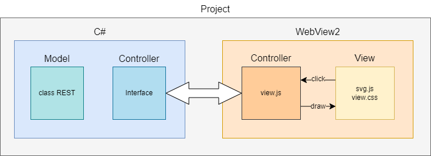

# Introduction

A simple project to define RESTful API endpoints via a graphical user interface and, output boilerplate code in a variety of languages. The purpose is to enable quick design and implementation.

There are various other projects that can do the same and this may seem like reinventing the wheel. This is a personal project allowing me to learn a variety of different languages and protocols and, because I wish to implement web APIs in my home automation. The output code is dependant on server capabilities. For example, a NAS could have PHP enabled but a smaller device, such as a Raspberry Pi, may not so could use RUST or Django instead.

# Languages Used

C\# for front end controller and model. C\# webview2, HTML, CSS, SVG and JavaScript for the view. RUST, PHP, C, C++, Django for generated boilerplate code output.

JavaScript used for simple node analysis and GUI layout of endpoint nodes.

Using HTML and SVG allowed the project to use CSS to easily alter the look of the program. SVG was chosen simply because it is a ready-made solution to drawing and enabling clickable elements on screen.

# Must-Haves, Should-Haves and Would-Like-to-Haves

### ‘Must-haves’ are the minimum requirements for the program to be usable.

| Objective                                           | Status                   |
|-----------------------------------------------------|--------------------------|
| Display endpoint nodes.                             | ✅                       |
| Add a path of nodes.                                | ✅                       |
| Edit a node for GET/POST/PATCH/DELETE requirements. | ✅ (may be updated)      |
| Save and load projects.                             | ✅ (saved as json files) |
| Use CSS for node element design (look and feel).    | ✅                       |
| Output boilerplate for PHP                          | In development.          |
| Output boilerplate for RUST                         | In development.          |
| Output boilerplate for Django                       | In development.          |
| Output boilerplate for C                            | In development.          |
| Output boilerplate for C++                          | In development.          |
| Auto generate documentation for the endpoints.      | In development.          |
| Test units                                          | During development.      |

### ‘Should-haves’ are requirements a project should have but are not necessary for a completed project.

| Objective      | Status |
|----------------|--------|
| Undo and Redo. | ❌     |
| Insert node    | ❌     |
| Delete node    | ❌     |

### ‘Would-like-to-haves’ are additions to the project that are not necessary but would enhance it.

| Objective         | Status |
|-------------------|--------|
| Database designer | ❌     |

# Project Model

As projects go, the model is simple. Figure 1 shows the project split into two main areas – C\# and WebView2. C\# Is the interface container and the model. WebView2 is the view.

# License

In general, any person can download and use this project. Please see the license.txt file that accompanies this project.

# Sample Screens
